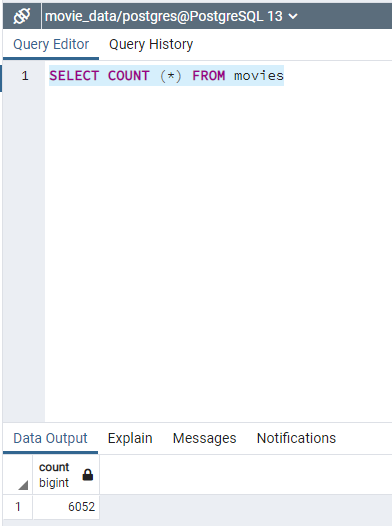
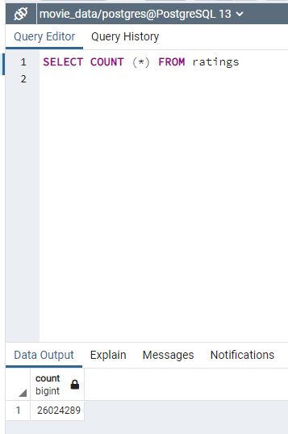

# Movies-ETL

## Purpose
1. Create an ETL pipeline from raw data to a SQL database.
2. Extract data from disparate sources using Python.
3. Clean and transform data using Pandas.
4. Use regular expressions to parse data and to transform text into numbers.
5. Load data with PostgreSQL.

## Project Background
Amazing Prime needs help to create an automated pipeline that takes in new data, performs the appropriate transformations, and loads the data into existing tables. Refactoring code is needed to create one function that takes in the three files—Wikipedia data, Kaggle metadata, and the MovieLens rating data—and performs the ETL process by adding the data to a PostgreSQL database.

## Results
### Sample of Movies Query Results in PgAdmin

### Sample of Ratings Query Results in PgAdmin

## Summary
A JSON file and 2 Kaggle files were extracted, transformed, and joined to create the above movies and ratings files loaded into a SQL database.
